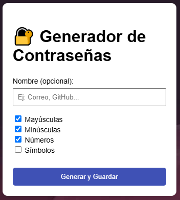
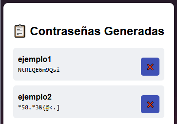

# Bienvenido a mi Generador de contraseñas (GDC)

## Tecnologías Utilizadas

-  GitHub: Para el control de versiones y colaboración en proyectos.
-  HTML: Utilizado para la estructura y el contenido de las páginas web.
-  CSS: Utilizado para el diseño y estilo de las páginas web.
-  JavaScript: Utilizado para crear las animaciones
 
- Este Proyecto Genera una contraseña aleatoria de 12 caracteres con los caracteres que se elija:

- Se muestran las contraseñas generadas aleatorias

¡Gracias por visitar mi Repositorio!
